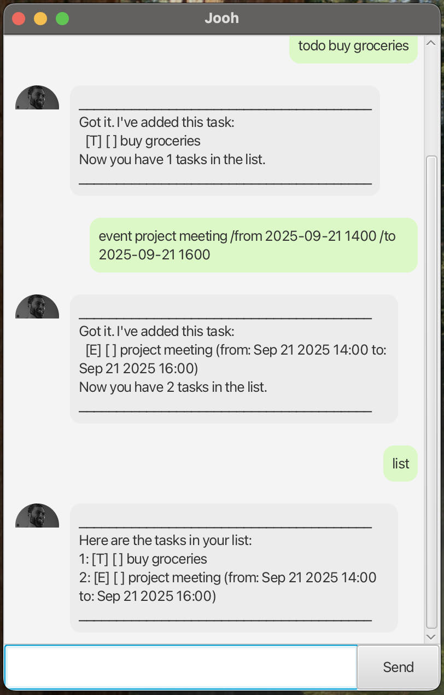

# Jooh User Guide

Jooh is a friendly chatbot that helps you manage your tasks through a simple GUI. It supports ToDos, Deadlines (with flexible datetime formats), Events, and Fixed Duration tasks. Tasks are auto-saved after each command and reloaded on startup. Jooh also handles errors gracefully by showing clear messages instead of crashing, making it a lightweight and reliable task assistant.

---

## Adding Deadlines

Adds a task that must be completed by a specific date and time.  
Jooh accepts multiple date formats:
- `yyyy-MM-dd HHmm` → `2025-09-30 2359`
- `MM/dd/yyyy HHmm` → `09/30/2025 2359`
- `yyyy-MM-dd HH:mm` → `2025-09-30 23:59`
- `MM/dd/yyyy HH:mm` → `09/30/2025 23:59`

**Example:**  
deadline return book /by 2025-09-30 2359

**Expected outcome:**  
Got it. I've added this task:
[D][ ] return book (by: Sep 30 2025 23:59)
Now you have 1 task in the list.

---

## Adding ToDos

Adds a simple task without a deadline or time.

**Example:**  
todo buy groceries

**Expected outcome:**  
Got it. I've added this task:
[T][ ] buy groceries
Now you have 2 tasks in the list.

---

## Adding Events

Adds a task that takes place within a specified time range.

**Example:**  
event project meeting /from 2025-09-21 1400 /to 2025-09-21 1600

**Expected outcome:**  
Got it. I've added this task:
[E][ ] project meeting (from: Sep 21 2025 14:00 to: Sep 21 2025 16:00)
Now you have 3 tasks in the list.

---

## Adding Fixed Duration Tasks

Adds a task that lasts for a fixed duration.

**Example:**  
fixed gym workout /for 2 hours

**Expected outcome:**  
Got it. I've added this task:
[F][ ] gym workout (for: 2 hours)
Now you have 4 tasks in the list.

---

## Listing All Tasks

Shows all tasks currently in the list.

**Example:**  
list

**Expected outcome:**  
Here are the tasks in your list:

[T][ ] buy groceries

[D][ ] return book (by: Sep 30 2025 23:59)

[E][ ] project meeting (from: Sep 21 2025 14:00 to: Sep 21 2025 16:00)

[F][ ] gym workout (for: 2 hours)

---

## Marking and Unmarking Tasks

Marks a task as done, or unmarks it as not done.

**Examples:**  
mark 1
unmark 1

**Expected outcomes:**  
Nice! I've marked this task as done:
[T][X] buy groceries

Copy code
OK, I've marked this task as not done yet:
[T][ ] buy groceries

---

## Deleting Tasks

Removes a task from the list.

**Example:**  
delete 2

**Expected outcome:**  
Noted. I've removed this task:
[D][ ] return book (by: Sep 30 2025 23:59)
Now you have 3 tasks in the list.

---

## Finding Tasks

Finds all tasks containing a given keyword.

**Example:**  
find book

**Expected outcome:**  
Here are the matching tasks in your list:

[D][ ] return book (by: Sep 30 2025 23:59)

---

## Exiting the App

Closes the application.

**Example:**  
bye

**Expected outcome:**  
The application window closes after Jooh says goodbye.

Bye. Hope to see you again soon!